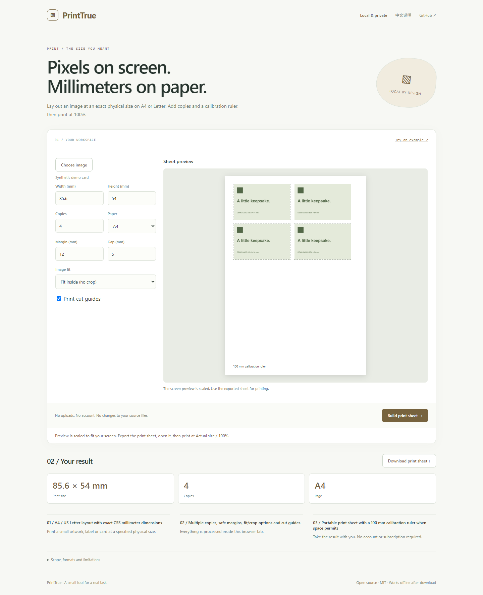

# PrintTrue

**Pixels on screen. Millimeters on paper.**

Lay out an image at an exact physical size on A4 or Letter. Add copies and a calibration ruler, then print at 100%.

[Open the app](https://sq2100.com/printtrue/) · [Download offline HTML](https://github.com/sq2100/printtrue/releases/latest) · [简体中文](README.zh-CN.md)



## Why use it?

Print a small artwork, label or card at a specified physical size.

- A4 / US Letter layout with exact CSS millimeter dimensions
- Multiple copies, safe margins, fit/crop options and cut guides
- Portable print sheet with a 100 mm calibration ruler when space permits

No uploads, account, API key, tracking scripts, or runtime CDN dependencies. The built app is a single HTML file. Source files are never modified.

## Quick start

Open the [hosted app](https://sq2100.com/printtrue/) and click **Try an example**. Or download the HTML from [Releases](https://github.com/sq2100/printtrue/releases/latest), then open it in a modern desktop browser.

To build from source (Node.js 20.19+):

```sh
npm ci
npm test
npm run build
```

Open `dist/index.html`, or run `npm start` for a local preview at http://127.0.0.1:4178. Set the `PORT` environment variable to run multiple projects simultaneously.

## Scope and limitations

Dimensions specify the image frame. Contain preserves the complete image with possible blank space; Cover crops from the center. Input images must be PNG, JPEG or WebP under 20 MiB. Print at Actual size / 100%, with browser headers/footers disabled and no extra margins. Printer drivers can scale or clip output; measure the calibration ruler after printing. Physical printer output has not been verified. This is not an official ID-photo compliance checker. Exported HTML embeds the original image data and may retain its metadata.

The initial version targets modern desktop browsers. Chromium is used for local smoke checks. Browser differences and real-world data may reveal additional edge cases; please report reproducible problems with synthetic examples. No guarantee of suitability for every input is made.

## Privacy

The app processes data in memory and has no application server, analytics, cookies, local storage or external runtime resources. A Content Security Policy blocks network connections and external scripts. User data is rendered as text, except for the intentionally previewed local images and validated colors.

The hosting provider receives normal page-request metadata (such as IP addresses). Download the HTML and open it offline for disconnected work. Exported files may contain your data. Browser extensions, the operating system and a modified hosted copy are outside this app's control.

## Development

Plain JavaScript, browser APIs, Node’s built-in test runner, and esbuild. Core logic lives in `src/core.js`; UI behavior is in `src/app.js`. Run `npm run format` before sending changes. GitHub Actions tests and builds each push; the separate Pages workflow publishes the demo when run manually.

[Contributing](CONTRIBUTING.md) · [Security](SECURITY.md) · [MIT license](LICENSE)
